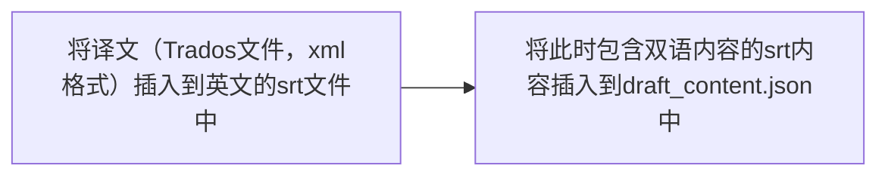

# 剪映-导入srt字幕

剪映还不支持导入srt字幕，本项目将srt字幕内容导入到剪映的项目中。

本项目分2部分：

**一**、将srt字幕导入到剪映工程中；

**二**、如果还提供了Trados译文，本项目可将Trados译文导入到srt中，再利用第一部分的功能，将双语字幕导入至剪映工程中。

## 一、 将srt字幕导入到剪映工程中

首先了解下剪映工程的构成：剪映会在一个工程目录中生成以下文件，其中`draft_content.json`  文件保存了字幕的信息，**目标**就是将srt内容导入该文件中：

```bash
/202204031840                # 工程目录名，默认是日期串
├─draft_agency_config.json
├─draft_content.json         # 重要文件，保存了项目的字幕、滤镜、视频等重要信息
├─draft_content.json.bak
├─draft_content.jsonold
├─draft_cover.jpg
├─draft_meta_info.json
└─template.tmp
```

srt插入到剪映工程步骤：

1、下载该项目，新建一个剪映工程，并准备要导入的srt字幕文件；

2、将您的工程下的`draft_content.json`放置`/template`目录下；

3、在该项目路径下执行

```shell
python insert_srt_into_ulikecam.py subtitle.srt # 将第一步生成的双语字幕文件导入至/template目录下的draft_content.json
```

4、此时`/template`目录下的`draft_content.json`已经包含双语，再替换原来项目的该文件即可。


## 二、先将Trados译文插入到srt文件，再将srt导入至剪映

将srt字幕加入到`draft_content.json`，流程分两步：



跟第一部分相似，只是多了将Trados译文文件插入到srt文件的步骤：

具体操作如下：

1、下载该项目，新建一个剪映工程；

2、将您的工程下的`draft_content.json`放置`/template`目录下；

3、将英文srt文件`subtitle.srt`、Trados译文文件`translation.sdlxliff` 放置`/template`同级目录；

4、在该项目路径下执行

```shell
python trados_translation_join_in_srt.py translation.sdlxliff subtitle.srt #生成subtitle-output.srt，里面就是双语字幕
python insert_srt_into_ulikecam.py subtitle-output.srt # 将第一步生成的双语字幕文件导入至/template目录下的draft_content.json
```

5、此时`/template`目录下的`draft_content.json`已经包含双语，再替换原来项目的该文件即可。